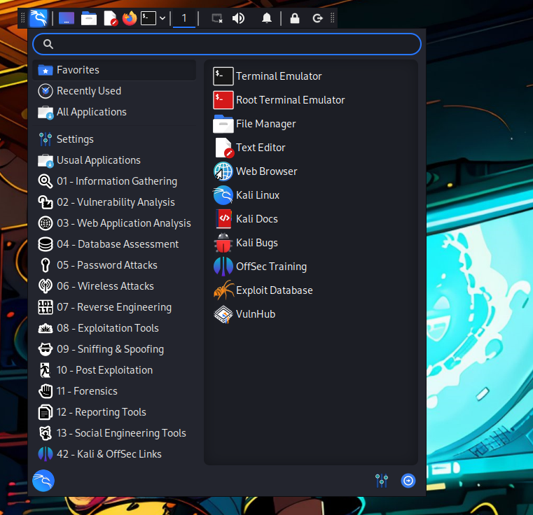

# 🖥️ WSL-Seamless
Seamless mode integration for WSL - Access Kali & Windows Simultaneously 🚀

<p align="center">
  
</p>

## Steps to Use 📝
1. **Install Kali-Linux in WSL on Windows**:
```bash
wsl --install --distribution kali-linux
```

- Activate it by entering `wsl` in the command prompt and setting up a username and password.
- If you have multiple distros, set Kali-Linux as your default:
  ```
  wsl --set-default kali-linux
  ```
- Install kex
  ```bash
  wsl
  sudo apt update
  sudo apt install -y kali-win-kex
  ```

2. **Download the `.bat` file**:
- Grab it from [here](https://github.com/pentestfunctions/WSL-Seamless/blob/main/seamless.bat) and save it to your desired location.

3. **Install VcXsrv**:
- Download from [SourceForge](https://ixpeering.dl.sourceforge.net/project/vcxsrv/vcxsrv/1.20.14.0/vcxsrv-64.1.20.14.0.installer.exe).
- Allow it through your firewall:
  - Press the Windows key, search for 'Firewall and Network Protection'.
  - Go to 'Allow an app through firewall' -> 'Change settings'.
  - Click 'Allow another app', navigate to your VcXsrv install path (default `C:\Program Files\VcXsrv`) and select the `vcxsrv` file.
  - Choose the tickbox for public/private networks as needed.

4. **Start the `.bat` File**:
- Double-click the `.bat` file whenever you want to start or restart it.

5. **Adjust the Taskbar**:
- Right-click the menu bar, choose 'Panel' -> 'Panel Preferences'.
- Adjust the length slider for a better fit and disable 'Lock Panel' for movement.
- Remove unwanted icons via the 'Items' tab.
- Move the taskbar by dragging the dotted area on its sides.

## How I size mine:
📸 Example sizing

- I have provided my xfce4-panel.config file in this repo so you can copy/paste it if required.

<p align="center">
  
</p>

## 🖥️ Code (seamless.bat)
- Essentially the code will create a config file used in xlaunch (vcxsrv)
- Then it will stop any current `vcxsrv` processes and any WSL kex processes
- Finally it will relaunch them fresh.

## 🐛 If you have errors
- A common error you might encounter is adjusting the height of the kali taskbar. If you increase the size and it crashes/wont open again, you will need to edit the file inside your WSL
  ```bash
  nano ~/.config/xfce4/xfconf/xfce-perchannel-xml/xfce4-panel.xml
  ```
1. Near the top you will see a line like thiis:
   ```bash
         <property name="size" type="uint" value="28"/>
   ```
2. You will need to change that `value=` preferably to something under 34 to ensure it works again correctly.
